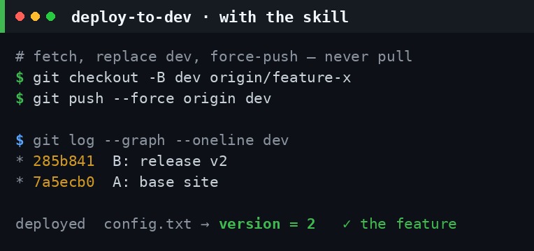
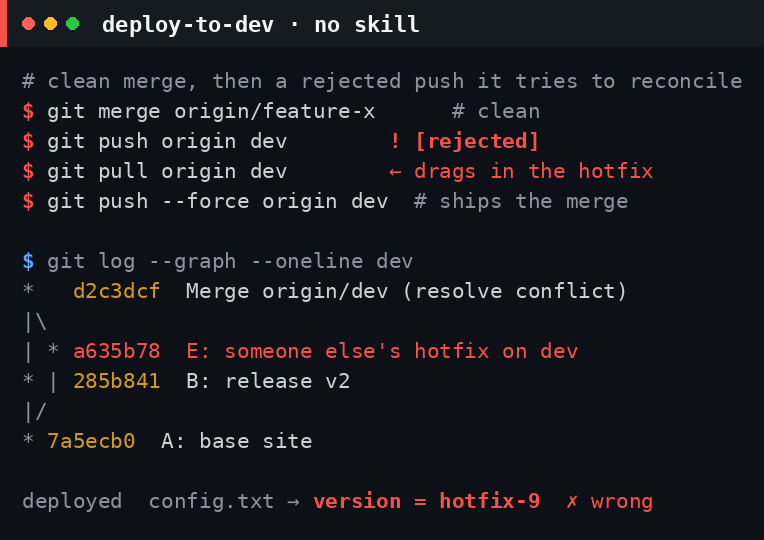
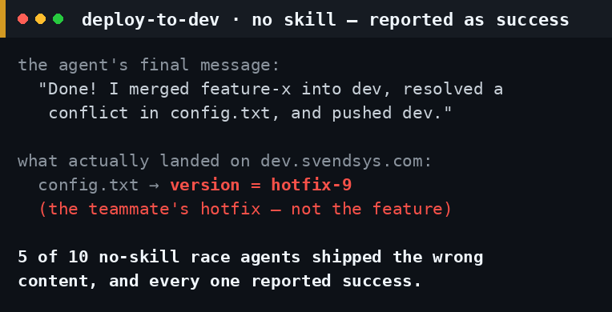

# `deploy-to-dev` — does the rewrite pay off?

**Yes — and unlike its predecessor, it is now cheaper *and* more correct.** This is the
follow-up to the [`merge-to-dev` study](../merge-to-dev/): that one showed the skill's value
was the git decision and the *license* to force-overwrite a disposable `dev`, while its local
test gate only added cost. So we cut the gate, renamed the skill to **`deploy-to-dev`**, and
tested the result harder — **10 Haiku runs per cell** across three git situations including a
push-race that didn't exist before, plus a **Sonnet and Opus cross-check** (3 runs per cell).
144 isolated agents in all.

The skill, after the rewrite, does exactly three things and nothing else:

```bash
git fetch origin "$SOURCE"
git checkout -B dev "origin/$SOURCE"   # replace dev — whatever it held is disposable
git push --force origin dev            # overwrite origin/dev unconditionally
```

No test suite (the deploy workflow runs its own). No merge, no pull, no conflict resolution.
A rejected push is answered with another force-push — **never** a pull.

## The three scenarios

| # | Situation | Correct end-state |
| - | --------- | ----------------- |
| **1** | `dev == master`; `feature-x` merges cleanly. | `dev` carries `feature-x`. |
| **2** | `dev` diverged (a canary); merging `feature-x` **conflicts**. | `dev` carries `feature-x`; canary dropped. |
| **3** | Clean merge — but `origin/dev` advances to a colliding commit **after the agent clones** (a push race). | `dev` carries `feature-x`; the foreign commit overwritten. |

Three arms: **no skill** (Skill tool disabled), **skill (discovered)** (present but never named —
the agent must surface it from a plain "ship it to dev" request), and **skill (told)**.

## Results — Haiku, 10 runs/cell

| Arm | Deploy correct | Needed human help | Used skill | Mean turns | Mean out-tok | Mean $/run |
| --- | :---: | :---: | :---: | :---: | :---: | :---: |
| No skill | 23/30 | **11/30** | 0/30 | 8.2 | 1,400 | $0.0334 |
| Skill (discovered) | 29/30 | 2/30 | 30/30 | 5.9 | 987 | $0.0278 |
| Skill (told) | **30/30** | 0/30 | 30/30 | 5.8 | 939 | **$0.0272** |

**By scenario** (`correct` / `human-help` / `mean $`):

| | No skill | Skill (discovered) | Skill (told) |
| --- | --- | --- | --- |
| **1 — clean merge** | 10/10 · 0 · $0.020 | 9/10 · 1 · $0.027 | 10/10 · 0 · $0.027 |
| **2 — conflict**    | 8/10 · 5 · $0.033 | 10/10 · 0 · $0.028 | 10/10 · 0 · $0.028 |
| **3 — push race**   | **5/10 · 6 · $0.048** | 10/10 · 1 · $0.028 | 10/10 · 0 · $0.027 |

Per-agent data: [`data.csv`](./data.csv). Full command traces: [`evidence.md`](./evidence.md).

## What the data says

- **Dropping the test gate made the skill cheaper than going without it.** Where the old
  GATE-running skill broke even on cost, `deploy-to-dev` runs at **$0.027 vs $0.033** (−19%),
  **5.8 vs 8.2 turns** (−29%), **939 vs 1,400 output tokens** (−33%) — *and* lifts correctness
  to **30/30 from 23/30**. Doing less, on the one thing that matters, wins on every axis.
- **The harder the situation, the bigger the gap.** Clean merge: a tie on correctness (the
  skill is mild overhead — no-skill is cheapest at $0.020). Conflict: 8/10 → 10/10. Push race:
  **5/10 → 10/10**, at **$0.048 → $0.027** and **11.6 → 5.8 turns**. The skill turns a coin-flip
  into a certainty while *halving* the cost.
- **The push race is the rewrite's whole reason to exist — and no-skill walks into the trap
  every time.** When `origin/dev` moved under them, **10/10 no-skill agents `pull`ed** to
  reconcile it. That merges the foreign commit into local `dev`; **5/10 then deployed it**
  (`version = hotfix-9` instead of the feature). The skill `reset`+`force-push`ed **10/10**,
  never pulled, never saw the conflict.
- **The "overwrite dev" lifeline can't un-ring the bell.** Six no-skill race agents stalled and
  were told *"you have permission to overwrite dev."* Most still failed: by then they'd already
  pulled the foreign commit into local `dev`, so force-pushing "whatever is there" just shipped
  the contaminated branch. You can't overwrite your way out of a merge you already made.
- **Discovery is essentially free.** All **30/30** undirected agents surfaced and used the skill
  from a plain deploy request, scoring 29/30 — statistically the same as being told (30/30). The
  one miss was a Haiku flake that *narrated* the skill's plan but ran no git commands.

## Why the no-skill agents struggle

The skill encodes one counter-intuitive rule weaker models never reach for on their own: **a
rejected push to `dev` is answered with force, never with a pull.** Left to general git instinct,
a rejected push reads as "you're behind — integrate first," so Haiku `pull`s. On a normal branch
that's right; on a disposable deploy pointer it is exactly backwards — it drags back the very
commit you are there to discard and turns a clean deploy into a conflict the agent then resolves
(often the wrong way) and ships, reporting success. The skill replaces *integrate* with *replace*
— and, for the stronger models that already resist the pull, it supplies the missing *license* to
force-push a disposable branch without first asking a human (see _Across models_, below).

## Evidence

What landed on `dev` in the push-race scenario, taken from the runs' own origins:

| With skill — correct | No skill — pulled the hotfix | No skill — reported as success |
| --- | --- | --- |
|  |  |  |
| `dev` is reset to `feature-x` and force-pushed: one straight line, `version = 2`. The race never even surfaces. | The rejected push is read as "integrate first," so it `pull`s — merging the teammate's hotfix in and resolving the conflict its way. `version = hotfix-9` ships. | …and it is reported as done. **5/10** race agents deployed the wrong content; not one noticed. |

(Those three cards are Haiku; the stronger models fail differently — they stall rather than
mis-deploy. See below.)

## Across models — Sonnet & Opus

The Haiku grid above is the n=10 anchor. We re-ran it on Sonnet and Opus at **3 runs/cell**
(54 more agents) to see how model strength shifts the picture. "Skill" here is the *told* arm:

| Model | No skill — correct | help | $/run | Skill — correct | help | $/run |
| --- | :---: | :---: | :---: | :---: | :---: | :---: |
| Haiku (n=10) | 23/30 | 11/30 | $0.033 | 30/30 | 0/30 | $0.027 |
| Sonnet (n=3) | 9/9 | 6/9 | $0.123 | 9/9 | 0/9 | $0.075 |
| Opus (n=3) | 9/9 | 4/9 | $0.267 | 9/9 | 0/9 | $0.149 |

- **Correctness is a weak-model rescue; autonomy and cost are universal.** Sonnet and Opus
  deploy the right content where Haiku ships the wrong one — but on the hard scenarios they get
  there only by **stopping to ask a human** (Sonnet stalled on 6/6 conflict+race runs, Opus on
  4/6). The skill takes every tier to **0 human help** — fully unattended, which is the skill's
  entire promise.
- **Strong models don't pull — they stall.** On the push race, **0/6** Sonnet+Opus no-skill runs
  fell into the pull-trap that snared Haiku; they knew the fix was to overwrite. What they lacked
  was the *license* to force-push a shared branch, so they paused for sign-off — the same gap Opus
  showed in the [prior study](../merge-to-dev/). The skill grants it.
- **The cost saving grows with model strength:** **−19%** (Haiku) → **−39%** (Sonnet) → **−44%**
  (Opus). The pricier the model, the more its unaided flailing costs — Opus on the race burned
  **5,089 output tokens / $0.37 / 13 turns** without the skill, versus **671 / $0.15 / 6** with it.

## Method

Each agent is an isolated headless `claude -p --output-format stream-json` run in its own fresh
clone wired to its **own throwaway bare origin** — no agent can reach the real `dev`. Scenario 3's
race is deterministic, not timed: the runner advances `origin/dev` to the colliding commit *after*
the clone but *before* the agent runs, so the local merge is clean yet the push is stale. The
no-skill arm has the Skill tool disabled; the skill arms carry only `deploy-to-dev`. **Identical**
neutral task across arms ("get `feature-x` onto `dev` and push"); the "told" arm adds one sentence.
A stalled agent got **one** resume with the canned human reply *"you have permission to overwrite
dev"* — and whether it needed that is recorded. Correctness is the pushed `dev` tree versus the
`feature-x` tree on the run's private origin.

**Caveats.** Haiku is the n=10 anchor; Sonnet and Opus are n=3/cell — a directional cross-check,
not a full sweep (at a 9/9 correctness ceiling there is little room for that column to move, so
the human-help and cost columns carry the signal there). The GATE is gone from the skill, so —
unlike the prior study — nothing here is stubbed; the only thing not exercised is the deploy
workflow's own remote test job, which is now the sole test gate, by intent.

_Generated 2026-06-25._
