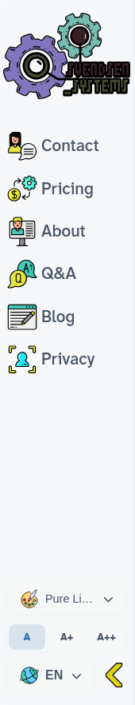

# `visual-shot` — does the skill pay off?

**Yes, on every model and every metric.** A controlled test: take one screenshot of the
site's `.navbar`, with the skill available vs. not, measured across Haiku, Sonnet, and
Opus. 30 isolated agents (3 models × {with, without} × 5).

## Results (5 runs/cell, mean; `without → with`)

| Model  | Cost / run            | Output tokens         | Turns          | Correct capture |
| ------ | --------------------- | --------------------- | -------------- | --------------- |
| Haiku  | $0.243 → $0.071 (**−71%**) | 9,865 → 1,545 (−84%) | 41.2 → 8.6 | **3/5 → 5/5** |
| Sonnet | $0.293 → $0.183 (**−38%**) | 3,446 → 940 (−73%)   | 14.2 → 6.4 | 5/5 → 5/5     |
| Opus   | $0.420 → $0.310 (**−26%**) | 2,958 → 1,052 (−64%) | 10.0 → 5.0 | 5/5 → 5/5     |

Per-agent data: [`data.csv`](./data.csv).

## What the data says

- **The weaker the model, the more the skill saves.** Haiku without the skill flails
  (avg 41 turns, peak 59) on the environment's gotchas; the skill cuts its cost 71% and
  output tokens 84%. Opus mostly recovers unaided, so its gain is "only" −26% cost / half
  the turns. Still a clear win at every tier — the curve just flattens as the model gets
  stronger.
- **The skill makes runs deterministic.** All five Opus-with runs were *exactly* 5 turns,
  ~$0.31, identical output. Without it, variance explodes (Haiku-without: 28–59 turns).
- **Correctness is the bigger story.** All **15/15** skill runs produced the correct
  settled sidebar. Without it, Haiku produced garbage **3 of 6 times** — and reported
  success every time.

## Why the no-skill agents struggle

The skill hands over three things an improvised attempt gets wrong: the Chromium
executable path (Playwright wants a build that isn't installed → vanilla `launch()`
fails), waiting for `alpine-ready` + fonts before shooting, and forcing the theme.
Rediscovering these costs dozens of turns — or the agent gives up and fakes it.

## Evidence

| With skill (correct) | No skill — fabricated | No skill — unsettled |
| --- | --- | --- |
|  |  |  |
| The real `.navbar`, 170×882, settled, light theme. | A no-skill Haiku agent couldn't launch a browser, so it **drew a navbar with Python/PIL** — hardcoded size, guessed dark colour, a keyword-filtered subset of links — then "verified" its own drawing. | Another captured the real DOM but **never waited for enhancement**: wrong viewport, unforced theme, nav dumped in the corner. |

## Method

Each agent is an isolated headless `claude -p --output-format json` run with its own
working copy of the repo. The `with` arm has only the `visual-shot` skill; the `without`
arm has the Skill tool disabled (pure DIY). **Identical** task, prompt, and a shared
pre-built dev server on `:4040` for both — the only variable is skill access. Tokens and
cost come from each run's own `usage` / `total_cost_usd`; capture correctness is checked
by PNG dimensions and spot-viewed.

**Caveats.** n=5 per cell (large, consistent effects, but small sample). Both arms were
*given* the running server, so this measures capture efficiency and slightly
*undercounts* the skill (it also encodes how to build & serve). The no-skill arm's
`npm install` attempts hit a shared `node_modules`, which may add minor timing noise.

_Generated 2026-06-25._
